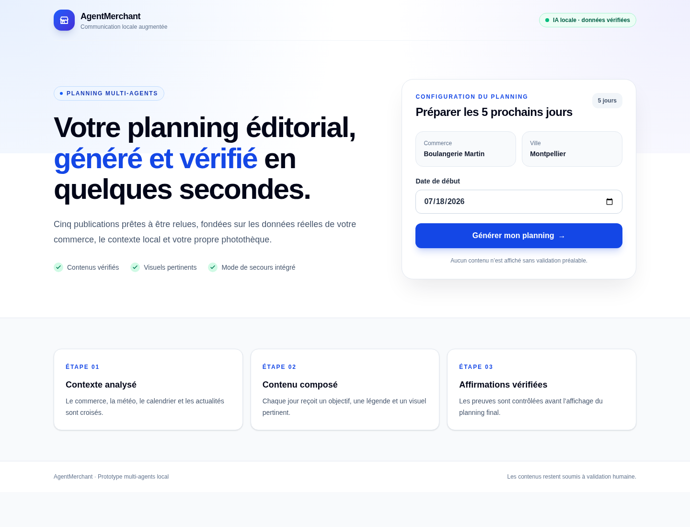
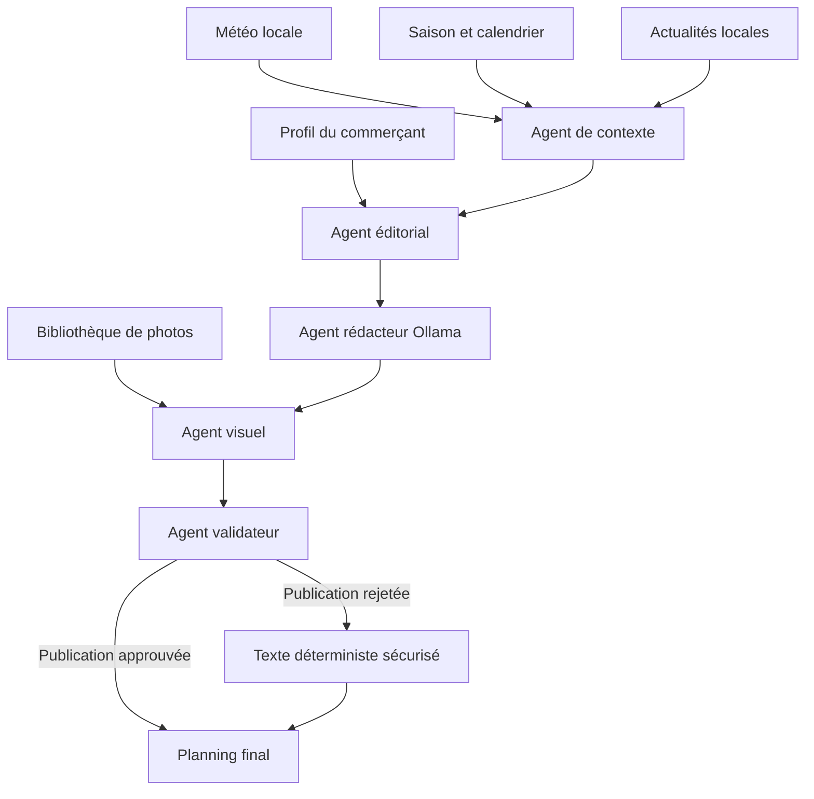

# AgentMerchant

AgentMerchant est un prototype de génération de contenu destiné aux commerces locaux.

À partir du profil vérifié d’un commerçant, d’une bibliothèque de photos et de plusieurs sources contextuelles, l’application génère un planning de publications pour cinq jours.

Le système prend en compte :

* les produits et services réellement proposés ;
* les photos disponibles ;
* la météo locale ;
* la saison et le calendrier ;
* les actualités locales pertinentes ;
* le ton de communication du commerce.

Chaque proposition est vérifiée avant son affichage afin de limiter les hallucinations et d’éviter l’invention de promotions, d’événements, de prix ou de services.



## Démonstration

Le projet utilise actuellement un commerce fictif :

**Boulangerie Martin**, une boulangerie artisanale située à Montpellier.

Le planning généré contient cinq publications avec, pour chacune :

* une date ;
* un objectif éditorial ;
* une légende ;
* un visuel sélectionné ;
* le contexte externe éventuellement utilisé ;
* les preuves associées aux affirmations ;
* un statut de validation.

## Fonctionnalités

### Planning éditorial sur cinq jours

L’agent éditorial sélectionne cinq sujets à partir des produits, services et informations vérifiés du commerçant.

### Rédaction par une IA locale

Les légendes sont rédigées avec Ollama et le modèle `llama3.2:3b`.

L’utilisation d’un modèle local permet de tester le prototype sans clé API payante.

Si Ollama est indisponible ou si sa réponse est invalide, AgentMerchant utilise automatiquement des textes déterministes de secours.

### Sélection des visuels

Chaque publication reçoit un visuel sélectionné selon :

* sa catégorie ;
* ses mots-clés ;
* sa description ;
* le sujet de la publication ;
* les images déjà utilisées.

Le système privilégie un visuel inédit et pertinent pour chaque jour.

Dans ce prototype, l’agent visuel n’analyse pas directement les pixels. Il
classe les photos de façon déterministe à partir des catégories, descriptions
et mots-clés renseignés dans la bibliothèque. Ce choix rend la démonstration
explicable et reproductible, mais suppose que les métadonnées soient fiables.

Avec une bibliothèque de plusieurs centaines de photos non catégorisées, une
étape d’ingestion serait nécessaire : description et catégorisation initiales
par un modèle de vision, indexation par embeddings, puis validation humaine des
métadonnées avant leur utilisation par le moteur de sélection.

### Météo locale

La météo est récupérée pour la ville du commerçant.

Elle n’est utilisée que lorsqu’elle apporte un contexte réellement utile. Une condition météo sans lien avec les produits ou services disponibles est volontairement ignorée.

Une panne du service météo ne bloque pas la génération du planning.

### Calendrier et saisonnalité

Le système prend en compte :

* la saison ;
* les week-ends ;
* les jours fériés français ;
* les horaires d’ouverture déclarés.

Un contexte saisonnier n’est utilisé que s’il est cohérent avec la publication et les horaires du commerce.

### Actualités locales

Des actualités récentes sont récupérées puis filtrées.

Pour être retenu, un article doit notamment :

* être lié à la ville du commerçant ;
* correspondre à son secteur, à un produit ou à un service vérifié ;
* ne pas appartenir à une catégorie sensible ou sans intérêt commercial.

Le titre, la source, la date et le lien de l’article sont conservés pour assurer sa traçabilité.

### Validation anti-hallucination

Chaque publication est contrôlée avant son affichage.

Le validateur recherche notamment :

* les promotions non déclarées ;
* les prix inventés ;
* les services non vérifiés ;
* les événements non déclarés ;
* les affirmations d’ouverture incohérentes ;
* les caractéristiques produit non vérifiées ;
* les adjectifs commerciaux non justifiés ;
* les preuves provenant d’un autre jour.

Lorsqu’une proposition générée par Ollama est rejetée, elle est remplacée par une version déterministe sécurisée.

## Architecture multi-agents

AgentMerchant utilise une architecture orchestrée composée de plusieurs agents spécialisés.



### Agent de contexte

Il analyse la météo, le calendrier, la saison et les actualités, puis conserve uniquement les informations utiles.

### Agent éditorial

Il définit les cinq objectifs de communication et associe les contextes retenus aux publications.

### Agent rédacteur

Il génère les légendes à partir d’une liste limitée de preuves autorisées.

### Agent visuel

Il classe les photos et sélectionne le visuel le plus pertinent pour chaque sujet.

### Agent validateur

Il vérifie les affirmations et rejette les contenus qui ne peuvent pas être justifiés.

## Technologies utilisées

* Next.js avec App Router
* React
* TypeScript
* Tailwind CSS
* Zod
* Ollama
* `llama3.2:3b`
* Open-Meteo
* Flux RSS d’actualités
* `fast-xml-parser`
* `date-fns`
* pnpm

## Structure du projet

```text
AgentMerchant/
├── data/
│   ├── merchant.json
│   └── photos.json
├── public/
│   └── merchant-photos/
├── src/
│   ├── app/
│   │   ├── api/
│   │   │   └── generate-plan/
│   │   │       └── route.ts
│   │   └── page.tsx
│   └── lib/
│       ├── agents/
│       │   ├── context-agent.ts
│       │   ├── editorial-agent.ts
│       │   ├── news-agent.ts
│       │   ├── season-agent.ts
│       │   ├── validator-agent.ts
│       │   ├── visual-agent.ts
│       │   └── writer-agent.ts
│       ├── schemas/
│       └── services/
├── .env.example
├── package.json
└── README.md
```

## Prérequis

Avant de lancer le projet, installez :

* Node.js 20 ou une version plus récente ;
* pnpm ;
* Ollama ;
* Git.

Le projet a été développé et testé sous Fedora avec Node.js 22.

## Installation

### 1. Cloner le dépôt

```bash
git clone https://github.com/Cyril29D/AgentMerchant.git
cd AgentMerchant
```

### 2. Installer les dépendances

```bash
pnpm install
```

### 3. Installer Ollama sous Linux

```bash
curl -fsSL https://ollama.com/install.sh | sh
```

Démarrez ensuite le service :

```bash
sudo systemctl enable --now ollama
```

Vous pouvez vérifier son état avec :

```bash
systemctl status ollama
```

### 4. Télécharger le modèle local

```bash
ollama pull llama3.2:3b
```

Vérifiez que le modèle est disponible :

```bash
ollama list
```

### 5. Configurer l’environnement

Copiez le fichier d’exemple :

```bash
cp .env.example .env.local
```

Configuration attendue :

```env
OLLAMA_BASE_URL=http://127.0.0.1:11434
OLLAMA_MODEL=llama3.2:3b
```

Aucune clé API payante n’est nécessaire.

### 6. Lancer l’application

```bash
pnpm dev
```

Ouvrez ensuite :

```text
http://localhost:3000
```

Sélectionnez une date de départ puis cliquez sur **Générer le planning**.

## Tester directement l’API

Le planning est généré par la route :

```text
POST /api/generate-plan
```

Exemple :

```bash
curl -X POST http://localhost:3000/api/generate-plan \
  -H "Content-Type: application/json" \
  -d '{"startDate":"2026-07-18"}'
```

La date doit respecter le format `YYYY-MM-DD`.

## Vérifications du projet

Vérifier la qualité du code :

```bash
pnpm lint
```

Exécuter les tests unitaires du validateur :

```bash
pnpm test
```

Vérifier la compilation de production :

```bash
pnpm build
```

## Fonctionnement sans Ollama

Si Ollama n’est pas lancé ou si le modèle n’est pas disponible, l’application continue de fonctionner.

Le statut du rédacteur devient alors :

```json
{
  "writer": "fallback"
}
```

Les publications sont générées à partir de modèles déterministes sécurisés.

## Données de démonstration

Le profil du commerçant est défini dans :

```text
data/merchant.json
```

La bibliothèque visuelle et les métadonnées des photos sont définies dans :

```text
data/photos.json
```

Les fichiers images sont placés dans :

```text
public/merchant-photos/
```

## Choix techniques

Le prototype sépare volontairement les responsabilités entre plusieurs agents.

Cette organisation permet :

* de limiter les informations transmises au modèle ;
* de tracer les preuves utilisées ;
* de tester chaque étape séparément ;
* de continuer à fonctionner lorsqu’un service externe est indisponible ;
* de remplacer une proposition risquée sans abandonner tout le planning.

La génération par IA n’est donc pas considérée comme une source de vérité. Elle intervient uniquement après la sélection des informations autorisées et reste soumise à une validation finale.

## Limites actuelles

Ce projet est un prototype réalisé dans un temps limité.

Ses principales limites sont :

* le profil du commerçant est actuellement stocké dans un fichier JSON ;
* les descriptions et catégories des photos sont renseignées manuellement et
  le moteur ne réalise pas encore d’analyse visuelle des pixels ;
* la bibliothèque de démonstration contient un nombre limité d’images ;
* le filtrage des actualités repose sur des mots-clés et des règles ;
* le validateur anti-hallucination ne peut pas couvrir toutes les formulations possibles ;
* la qualité des textes dépend du modèle Ollama installé ;
* aucune base de données n’est utilisée ;
* il n’existe pas encore d’authentification ;
* les publications ne sont pas envoyées directement vers les réseaux sociaux ;
* aucun historique de planning n’est conservé ;
* les tests automatisés couvrent les règles critiques du validateur, mais pas
  encore les agents de contexte ni la route API complète.

## Améliorations envisagées

Une version plus avancée pourrait intégrer :

* un formulaire complet de configuration du commerce ;
* l’import et la gestion de plusieurs bibliothèques de photos ;
* un pipeline d’ingestion combinant vision, catégorisation automatique et
  validation humaine des photos ;
* une recherche sémantique par embeddings pour sélectionner les visuels dans
  une bibliothèque volumineuse ;
* une base PostgreSQL ;
* un système d’authentification ;
* un historique des plannings générés ;
* une interface de modification et de validation humaine ;
* une couverture de tests étendue aux agents de contexte et aux parcours API ;
* une exécution avec Docker Compose ;
* une intégration avec Instagram, Facebook ou LinkedIn ;
* un système de publication programmée ;
* une validation factuelle plus avancée.

## Confidentialité

Le fichier `.env.local` ne doit jamais être ajouté au dépôt Git.

Le fichier `.env.example` contient uniquement les noms des variables nécessaires et peut être publié.

Les photos de démonstration doivent appartenir à l’auteur du projet ou être utilisables selon leur licence.

## Auteur

**Cyril Delly**

* GitHub : `Cyril29D`
* Projet : `AgentMerchant`
